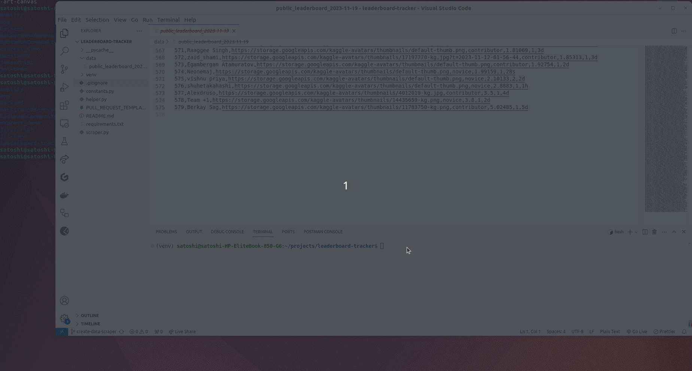

# LeaderBoard Tracker

### Description

This repository helps people track the public leaderboard progress of Kaggle Competitions with the power of GitHub Actions. This repository also includes a data visualization application with Streamlit.


### How to track Other Leader Board 
- Fork this repository
- change the LEADERBOARD_URL to the one you like to track in the constants.py.
- check the action setting and change workflow permission "read and write permissions" 
- GitHub actions will run the scraping script and update the repository with newly scraped data
- Once the competition is over, you can disable the action.

### How to run Streamlit App 
- Clone the repo in your local machine
- Update the app/constants.py with the title and url of Kaggle Competition you are tracking
- In the root folder, run ```pip install``` on the virtual environment.
- Run ```streamlit run app/main.py``` in the root folder
- The app will be at http://localhost:8501

### How to deploy Streamlit App
Streamlit provides developers with a community cloud server. Just follow the instruction on the [link](https://docs.streamlit.io/streamlit-community-cloud/deploy-your-app) 

You can check live page [here](https://kaggle-leadearboard-tracker.streamlit.app/)

### Scraping Demo
if you would like to see how selenium scrapes the data, you can comment out ```chrome_options.add_argument("--headless")``` in the scraper.py.
After running ```pip install -r requirements.txt```, your can run scraper.py


<p align='center' width="500">

</p>

### Background

This project was created for [MLH 2023 Nov Hackathon](https://hackfest-november.devpost.com/)
